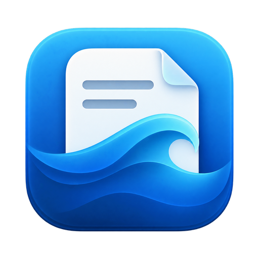
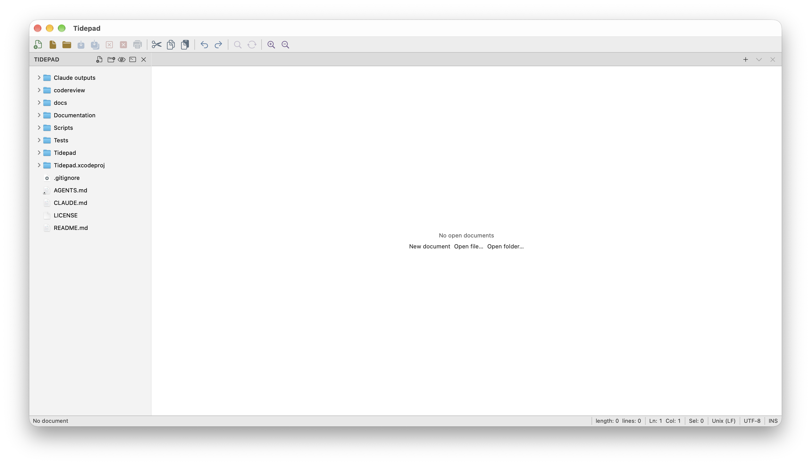
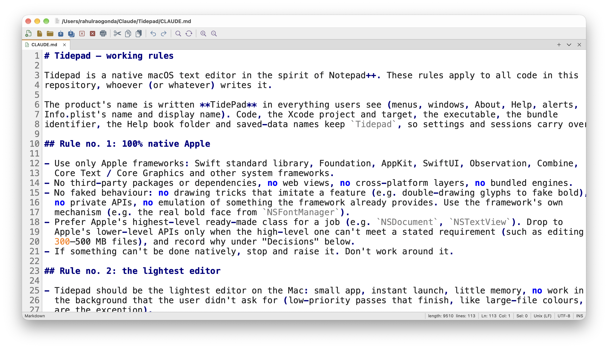
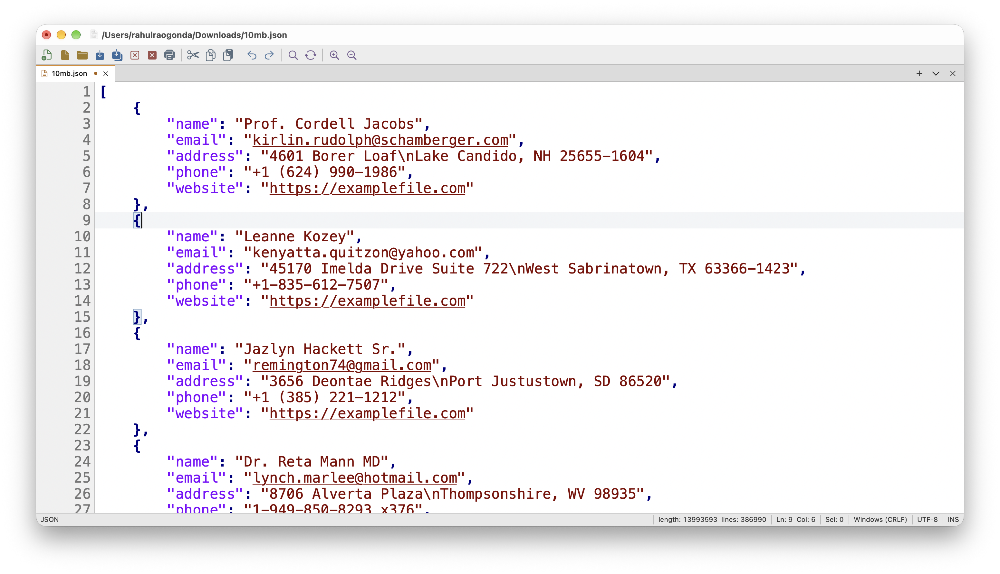
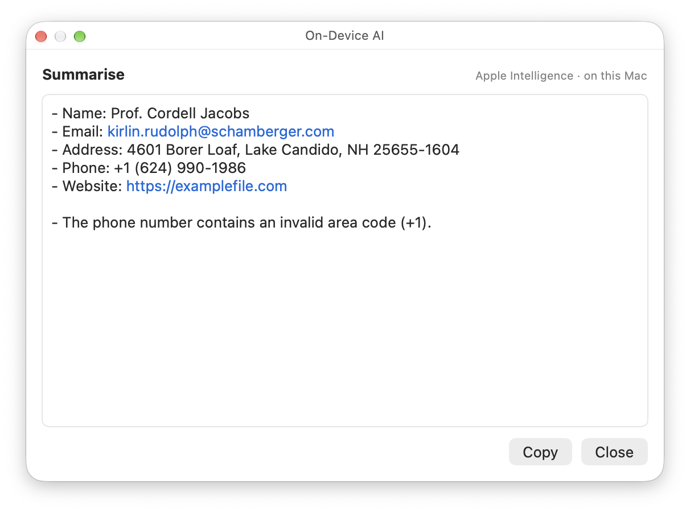
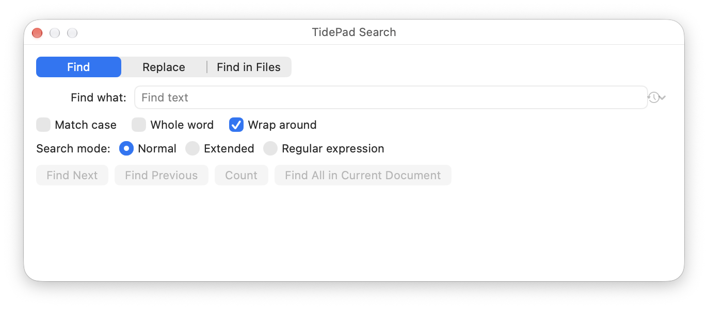
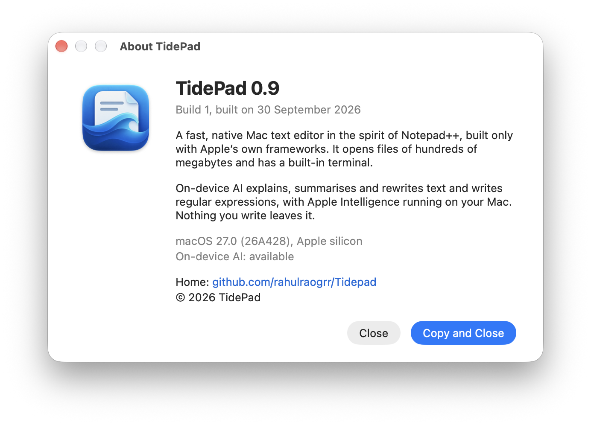

<p align="center">
  
</p>

<h1 align="center">TidePad</h1>

<p align="center">
  <b>A fast, native Mac text editor in the spirit of Notepad++.</b><br>
  Built only with Apple’s own frameworks. Opens files of hundreds of megabytes. Private, on-device AI.
</p>

<p align="center">
  
  
  
  
  
  
</p>

<p align="center">
  <a href="#features">Features</a> ·
  <a href="#screenshots">Screenshots</a> ·
  <a href="#performance">Performance</a> ·
  <a href="#requirements">Requirements</a> ·
  <a href="#building-from-source">Building</a>
</p>

<p align="center">
  
</p>

## What TidePad is

TidePad is a text editor for people who liked Notepad++ and moved to a Mac. It opens instantly, stays out of the way, and handles the files other editors choke on.

- ✅ **Truly native.** SwiftUI, AppKit, Core Text and Foundation only. No Electron, no web views, no third-party code.
- ✅ **Huge files.** Logs, dumps and exports of 300–500 MB open in a moment and stay smooth to scroll, edit, search and save.
- ✅ **Light.** A small app that launches instantly and uses little memory. Nothing runs in the background that you didn’t ask for.
- ✅ **Private AI.** Explain, summarise and rewrite text, or describe what to find and get a regular expression, with Apple Intelligence running on your Mac. Nothing you write leaves it.
- ✅ **Familiar.** Tabs, a Notepad++-style toolbar, encodings, line endings, Find in Files and the Tools you expect.

## Screenshots

<p align="center">
  <br>
  <i>Light mode: tabs, toolbar, syntax colours and the status bar.</i>
</p>

<p align="center">
  <br>
  <i>A 500 MB file: opens in a moment, scrolls smoothly, with colours and Go to Line.</i>
</p>

<p align="center">
  <br>
  <i>On-device AI: Explain, Summarise, Rewrite and Write Regular Expression, all on your Mac.</i>
</p>

<p align="center">
  <br>
  <i>Find, Replace and Find in Files, with regular expressions, in files of any size.</i>
</p>

<p align="center">
  <br>
  <i>About TidePad.</i>
</p>

## Features

**Editing:** tabs with unsaved-change dots, a Notepad++-style toolbar, line numbers, bracket matching, zoom, word wrap, duplicate, delete and move lines, sort lines, remove duplicate lines, UPPERCASE / lowercase / Title Case, and Format JSON, XML and SQL. Every tool undoes in one step.

**Languages:** syntax colours for Swift, Java, JSON, XML, SQL, JavaScript, TypeScript, HTML, CSS, YAML and Markdown, in Notepad++’s classic colours with real bold keywords, in light and dark mode.

**Large files:** files from 64 MB up open in TidePad’s large-file view, which reads only what’s on screen. Type, paste, undo, find and replace (including regular expressions), colours, Go to Line and save, all without loading the file into memory. Unsaved edits to a large file survive quitting.

**Search:** Find, Replace, Replace All, Count, Find in Files, Go to Line; normal, extended (`\n`, `\t`) and regular-expression modes; match case and whole word.

**Files:** encodings (UTF-8, UTF-16, Windows and ISO code pages, Japanese, Chinese, Korean, Telugu and more), reopen with a different encoding, convert encodings and line endings (LF, CRLF, CR), printing, recent files, and unsaved work kept between launches.

**Workspace:** a project sidebar for a folder (respecting `.gitignore`), and a built-in terminal with tabs, colours, mouse support and VoiceOver.

**On-device AI** (macOS 26+, Apple Intelligence): Explain, Summarise, Rewrite (fix spelling and grammar, make shorter, make a list) and Write Regular Expression, from Tools ▸ On-Device AI or the right-click menu. Answers appear as they’re written; a rewrite goes in only when you click Replace, and undoes in one step.

**Help:** a complete Apple Help book, searchable from the Help menu.

## Performance

Measured on a MacBook Air with M1 (Debug build unless noted):

| | |
|---|---|
| Plain-text find in a large file | **7.4 GB/s** |
| Open a 64 MB file | **0.55 s** |
| Typing in a 64 MB file | **0.6 ms** per key |
| Save a 64 MB file | **0.24 s** |
| Any screen of a 500 MB file (Core Text) | **1.3 ms** |
| Syntax colouring (optimised build) | **148 MB/s** |
| Jump to the end of a 10 MB JSON file, coloured | **82 ms** |

## Requirements

| | |
|---|---|
| macOS | 14 Sonoma or later |
| Processor | Apple silicon or Intel |
| On-device AI | macOS 26 or later, with Apple Intelligence turned on |

## Building from source

You need Xcode 26 or later.

```sh
git clone https://github.com/rahulraogrr/Tidepad.git
cd Tidepad
xcodebuild -project Tidepad.xcodeproj -scheme Tidepad -derivedDataPath build/DerivedData build
open build/DerivedData/Build/Products/Debug/Tidepad.app
```

Run the checks (about ten test programs covering storage, syntax, search, the terminal, large files, AI prompts and the editor itself):

```sh
Tests/run-checks.sh
```

## Principles

1. **100% native Apple.** Only Apple’s frameworks, no third-party code, no faked behaviour. Apple’s highest-level API first; lower-level APIs only where a requirement demands it, with the reason recorded in [CLAUDE.md](CLAUDE.md).
2. **The lightest editor.** Small app, instant launch, little memory, nothing bundled that macOS already ships, and nothing running that you didn’t ask for.

## Status

TidePad 0.9 is feature-complete for daily use and in testing. Signed and notarised downloads will follow after heavy testing.

## License

Copyright © 2026 TidePad. All rights reserved.

The source code is published so it can be read. No licence is granted: you may not copy, modify, distribute or use it, in whole or in part, without written permission. See [LICENSE](LICENSE).

## Credits

Inspired by [Notepad++](https://notepad-plus-plus.org) by Don Ho. TidePad shares no code with it.

<p align="center"><sub>© 2026 TidePad</sub></p>
